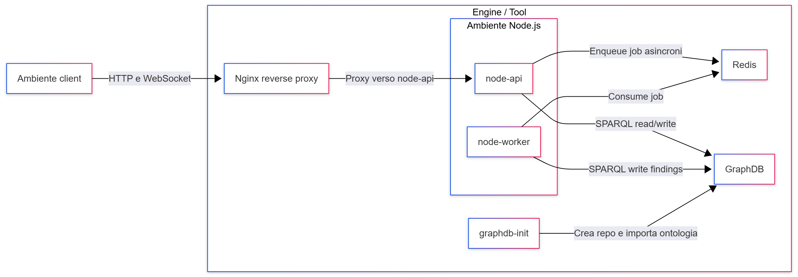

# Engine/Tool

---

1. [Node.js Environment](./2_2_Engine_Tool/2_2_1_NodeJSEnv.md)
   
   1. [API Express](./2_2_Engine_Tool/2_2_1_NodeJSEnv/2_2_1_1_APIExpress.md)
   
   2. [Worker](./2_2_Engine_Tool/2_2_1_NodeJSEnv/2_2_1_2_Worker.md)

2. [Nginx](./2_2_Engine_Tool/2_2_2_Nginx.md)

3. [Redis](./2_2_Engine_Tool/2_2_3_Redis.md)

4. [GraphDB](./2_2_Engine_Tool/2_2_4_GraphDB.md)

---

---

L’Engine (o Tool) è il cuore backend di OntoWeb-PT. È il sottosistema che riceve i dati prodotti dall’ambiente client (estensione browser e dashboard), li elabora tramite pipeline sincrone e asincrone e li organizza nel knowledge graph ospitato in GraphDB. Dal punto di vista architetturale, l’Engine realizza tutte le funzionalità “pesanti” del sistema: parsing, normalizzazione, arricchimento, persistenza e esposizione dei dati tramite API e interfacce di consultazione.

## Docker Compose

L’Engine è eseguito tramite uno stack Docker Compose che raccoglie in un unico ambiente orchestrato i diversi servizi necessari: un reverse proxy Nginx, lo strato applicativo Node.js (suddiviso logicamente nell’Ambiente Node.js), Redis come backend per le code di job, GraphDB come database RDF per il knowledge graph e un container di inizializzazione dedicato (graphdb-init). Il file di composizione definisce le reti interne (frontend e backend), i volumi persistenti per Redis e GraphDB, le dipendenze tra i servizi e le variabili d’ambiente necessarie alla configurazione del sistema. In questo modo è possibile avviare l’intero Engine con un singolo comando, ottenendo un ambiente riproducibile e auto-consistente.

## Ambiente Node.js

All’interno dello stack Docker, l’Ambiente Node.js rappresenta il livello applicativo dell’Engine. È costruito a partire da un unico progetto Node.js che viene eseguito in due ruoli distinti, separati in due container: uno dedicato all’esposizione delle API e della dashboard, l’altro all’elaborazione asincrona dei job. A livello architetturale, l’Ambiente Node.js è responsabile di quattro compiti principali: esporre le API HTTP e i WebSocket usati dall’ambiente client, orchestrare l’invio dei job asincroni verso Redis, applicare i resolver di sicurezza per trasformare i dati in entità ontologiche e interagire con GraphDB tramite query SPARQL di lettura e scrittura.

## Redis

Redis viene utilizzato come infrastruttura di messaggistica interna all’Engine, principalmente per la gestione delle code di job tramite BullMQ. Le richieste provenienti dall’ambiente client che richiedono un’elaborazione non immediata (ad esempio l’analisi delle tecnologie rilevate, la risoluzione dei finding HTML/JS o l’elaborazione di grandi insiemi di richieste HTTP estratte da file PCAP) vengono tradotte in job e inserite in code Redis dal componente API dell’Ambiente Node.js. Il Worker, in esecuzione in un container separato, si sottoscrive a queste code, consuma i job e produce i risultati, che vengono poi inseriti in GraphDB o resi disponibili alle API per la consultazione. In questo modo Redis permette di disaccoppiare il tempo di risposta delle API dal tempo di elaborazione delle analisi più pesanti, migliorando reattività e robustezza del sistema.

## GraphDB

GraphDB è il componente di persistenza centrale dell’Engine e ospita il knowledge graph di OntoWeb-PT. Al suo interno viene creata la repository dedicata, che viene inizializzata con l’ontologia OntoWebPT. L'ontologia definisce il modello concettuale utilizzato per rappresentare richieste e risposte HTTP, header, cookie, URI, contenuti HTML, resolver, finding di sicurezza e vulnerabilità note (CVE, CWE, categorie OWASP, ecc.). Tutti i dati elaborati dai resolver e dalle pipeline di import vengono mappati su questo modello e memorizzati come triple RDF.

L’accesso a GraphDB avviene tramite endpoint SPARQL: l’Ambiente Node.js invia query di inserimento e aggiornamento per popolare e arricchire il grafo, e query di lettura per recuperare le informazioni necessarie alla dashboard e alle risposte delle API. GraphDB funge così da “memoria a lungo termine” del sistema, abilitando non solo la semplice consultazione dei risultati delle scansioni, ma anche interrogazioni più complesse e correlazioni tra diverse sorgenti di dati.

## GraphDB Init

Il container graphdb-init ha il compito di garantire che l’istanza di GraphDB sia correttamente inizializzata a ogni nuovo avvio dello stack. All’avvio, questo servizio attende che GraphDB risponda, verifica l’esistenza della repository prevista e, se necessario, la crea utilizzando un file di configurazione fornito nel progetto. Successivamente controlla se l’ontologia OntoWebPT è già presente; in caso contrario, la importa automaticamente a partire dal file RDF incluso nei volumi del container. Tale meccanismo rende la preparazione dell’ambiente automatizzata e riduce la necessità di interventi manuali nella configurazione del knowledge graph.

## Nginx

Nginx agisce come reverse proxy e punto di ingresso unico dell’Engine. È il solo servizio esposto direttamente sulla rete frontend e riceve tutto il traffico in ingresso proveniente dall’ambiente client, sia HTTP che WebSocket. In base alla configurazione di routing, Nginx inoltra le richieste verso il container dell’Ambiente Node.js responsabile delle API, si occupa di servire la dashboard web (che viene fornita come contenuto statico dal backend) e può esporre endpoint di healthcheck utilizzati per monitorare lo stato complessivo del sistema. Nginx ha il ruolo di isolare i servizi interni (Node.js, Redis, GraphDB) dall’esterno, centralizzando la terminazione delle connessioni e semplificando la configurazione di porte, host e regole di accesso.
