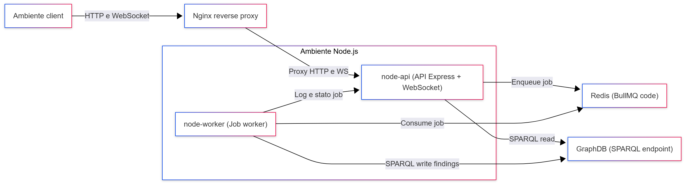

# Ambiente Node.js
---

- [API Express](./2_2_1_NodeJSEnv/2_2_1_1_APIExpress.md)
- [Worker](./2_2_1_NodeJSEnv/2_2_1_2_Worker.md)

---

---

L’Ambiente Node.js rappresenta lo strato applicativo dell’Engine/Tool ed è il punto in cui la logica di business di OntoWeb-PT viene effettivamente eseguita. Tutte le interazioni provenienti dall’ambiente client, sia tramite API HTTP sia tramite WebSocket, terminano su questo livello, che si occupa di validare i dati in ingresso, orchestrare le pipeline di elaborazione sincrone e asincrone, interagire con Redis e GraphDB e restituire al penetration tester una vista coerente delle evidenze raccolte.

---

## Ruoli

Dal punto di vista implementativo, l’Ambiente Node.js è costruito come un singolo progetto Node.js che viene eseguito con due ruoli distinti: un processo API, responsabile dell’esposizione delle interfacce esterne, e un processo Worker, dedicato all’elaborazione dei job asincroni. Nel docker compose questi due ruoli corrispondono a due container separati, `node-api` e `node-worker`, che condividono lo stesso codice sorgente, lo stesso modello dati e la stessa configurazione di base, ma vengono avviati con comandi diversi e con un set di variabili d’ambiente specifiche per ciascuna funzione.

---

## Node.js: API

Il processo API utilizza Express come framework HTTP per organizzare le route in router tematici (ad esempio Techstack, Analyzer, HttpRequests, Pcap, Sparql) e per fornire un punto di ingresso uniforme ai vari flussi applicativi: invio dei risultati delle scansioni dall’estensione, upload dei file PCAP e delle chiavi TLS dalla dashboard, interrogazione sincrona del knowledge graph per popolare le viste lato frontend. Oltre alle API REST, il processo API gestisce anche i canali WebSocket utilizzati sia dalla dashboard sia dall’estensione per ricevere log in tempo reale, stato dei job e notifiche di completamento.

---

## Node.js: Worker

Il processo Worker è invece focalizzato sull’elaborazione in background. Attraverso BullMQ e Redis, sottoscrive le code di job create dall’API (ad esempio per l’analisi del tech stack, dei componenti HTML/JavaScript o del traffico HTTP) e applica i resolver che trasformano i dati grezzi in finding strutturati secondo l’ontologia OntoWeb-PT. Il Worker si occupa di eseguire le elaborazioni più costose, eventualmente arricchendo le informazioni con dati esterni, e di tradurre i risultati in query SPARQL che vengono poi inviate a GraphDB per la persistenza.

---

## Flusso Dati

In termini di flusso dati, l’Ambiente Node.js costituisce l’anello di congiunzione tra l’ambiente client e i servizi di infrastruttura dell’Engine. Le richieste in arrivo dalle interfacce utente vengono ricevute dall’API, validate e, a seconda del caso, soddisfatte immediatamente tramite letture mirate su GraphDB oppure trasformate in job inseriti nelle code su Redis. Il Worker consuma questi job, elabora i dati e aggiorna il knowledge graph; una volta completato il lavoro, gli esiti sono accessibili tramite nuove chiamate alle API oppure notificati in tempo reale via WebSocket. Entrambi i processi fanno uso di un sistema di logging comune, e il processo API espone questi log verso l’esterno per consentire alla dashboard di costruire viste di monitoraggio dello stato del sistema.

---
