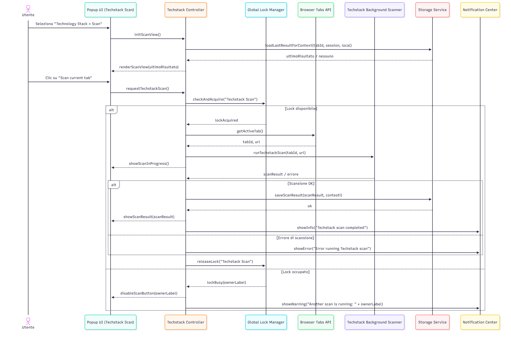
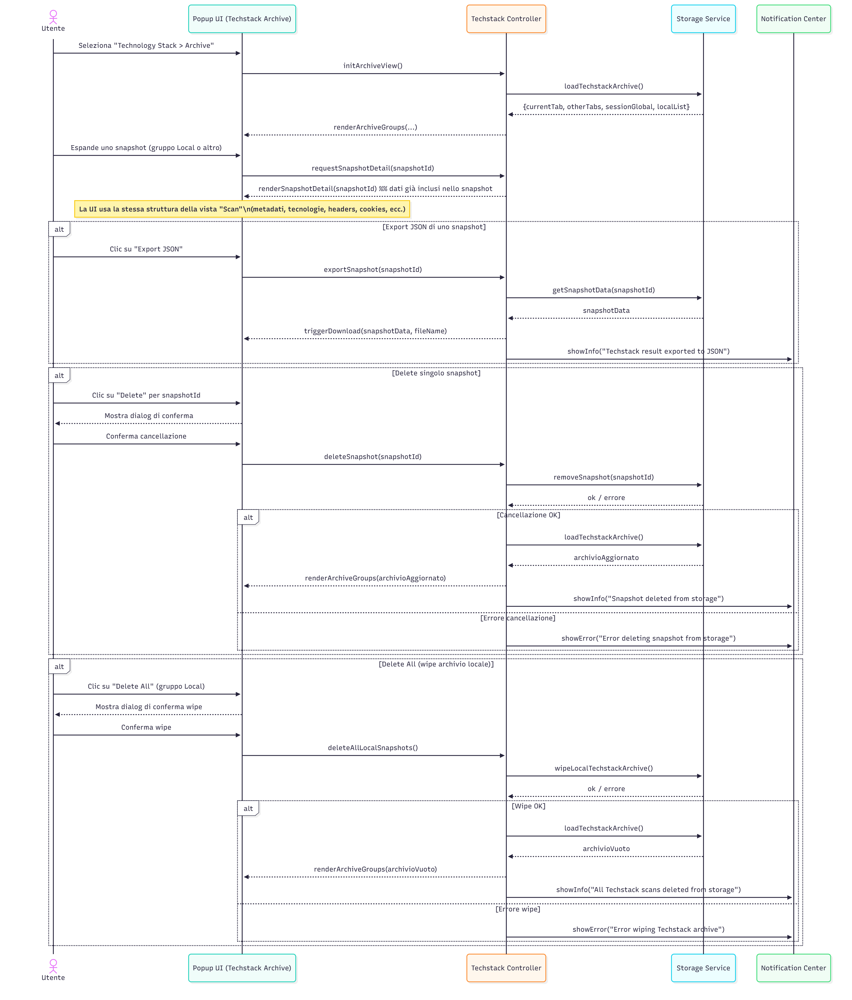

# Techstack - Sequence Diagrams

---

**SD-EXT-TS-01 – Avvio scansione Technology Stack sulla scheda corrente (Scan current tab)**

Descrizione (alto livello):

Questo diagramma mostra cosa succede quando l’utente apre la sottosezione “Scan” di Technology Stack e avvia una nuova scansione della scheda corrente.  
La UI inizializza la vista chiedendo al controller Techstack di caricare l’ultimo risultato disponibile e, successivamente, alla pressione del pulsante di scan:

- il controller verifica/ottiene il lock globale;

- se il lock è disponibile, recupera la tab attiva, invoca il componente di scansione (background/content script), mostra lo stato di avanzamento e, al termine, salva e visualizza i risultati;

- in caso di errore di scansione, viene mostrata una notifica di errore;

- se il lock è occupato da un altro modulo, il pulsante viene disabilitato e una notifica spiega che è in corso un’altra scansione.

---

**SD-EXT-TS-02 – Caricamento automatico dell’ultimo risultato Techstack (priorità per contesto)**

Descrizione (alto livello):

Questo diagramma dettaglia la logica di caricamento automatico dell’ultimo risultato Techstack quando l’utente apre la vista “Scan”:

- il controller tenta prima di recuperare l’ultimo risultato legato alla tab corrente;

- se non esiste, prova con l’ultima sessione globale;

- se ancora non trova nulla, prova con l’ultimo snapshot persistito in archivio locale;

- ogni volta che un risultato viene trovato, la UI viene aggiornata e l’utente riceve una notifica che indica da dove provengono i dati;

- se non ci sono risultati in nessun contesto, viene mostrato uno stato “vuoto” che invita ad effettuare una prima scansione.

---

**SD-EXT-TS-03 – Consultazione ed amministrazione dell’archivio Techstack (Archive, export, delete)**

Descrizione (alto livello):

Questo diagramma rappresenta le interazioni nella sottosezione “Archive” di Technology Stack:

- caricamento iniziale dell’archivio suddiviso per contesti (Current tab, Other tabs, Session, Local);

- espansione di uno snapshot e visualizzazione dei dettagli con la stessa struttura della vista Scan;

- esportazione di un singolo snapshot in JSON;

- cancellazione mirata di un singolo snapshot e cancellazione massiva (“Delete All”) dell’archivio locale, con ricarica dell’elenco e notifiche di conferma o errore.

---

**SD-EXT-TS-04 – Workflow “Analyze” Techstack + invio al backend e monitoraggio job**

Descrizione (alto livello):

Questo diagramma riassume il flusso guidato “Analyze” per Technology Stack:

- all’ingresso nel wizard, il controller verifica lo stato del tool (Tool On/Off) e del lock globale; se le precondizioni non sono soddisfatte, i pulsanti di avanzamento vengono disabilitati e l’utente è informato tramite messaggio;

- se tutto è OK, il sistema carica dal locale l’elenco delle scansioni Techstack disponibili e permette all’utente di selezionarne una;

- lo snapshot selezionato viene mostrato in anteprima; da lì l’utente può inviarlo al backend per l’analisi;

- al click su “Send Scan” vengono nuovamente controllati stato del tool e lock; se le condizioni sono soddisfatte, il payload viene inviato all’API del backend;

- se il job è accettato, viene avviato il monitoraggio tramite un componente di Job Monitor che interroga periodicamente il backend (e/o riceve eventi) aggiornando il dialog “Job Summaries”;

- quando tutti i job relativi all’analisi sono completati o falliti, il monitoraggio si ferma e l’utente può chiudere il dialog, causando il reset del wizard e consentendo eventualmente un nuovo ciclo di Analyze.

---
