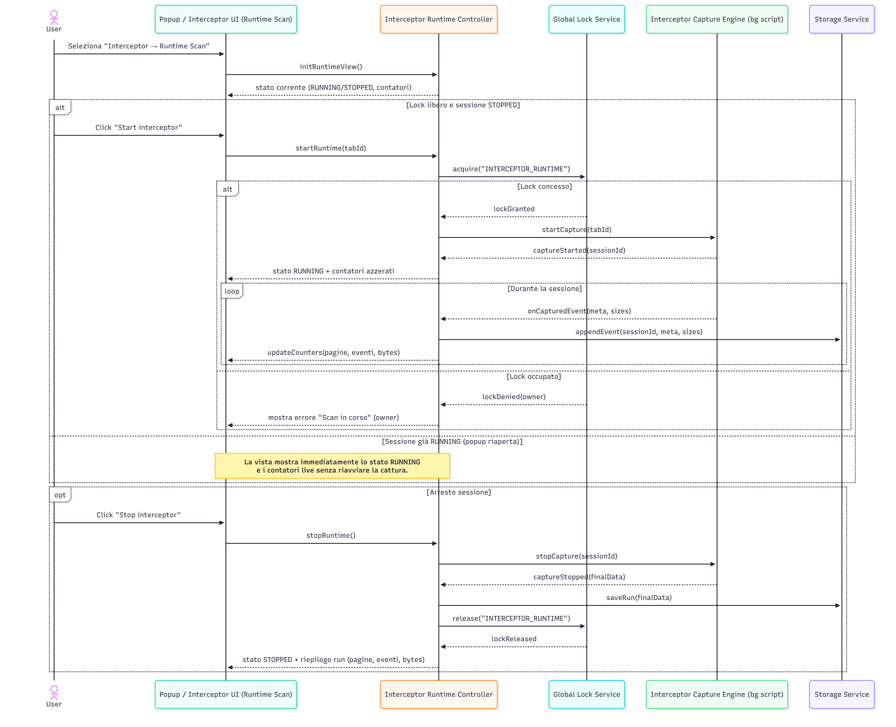
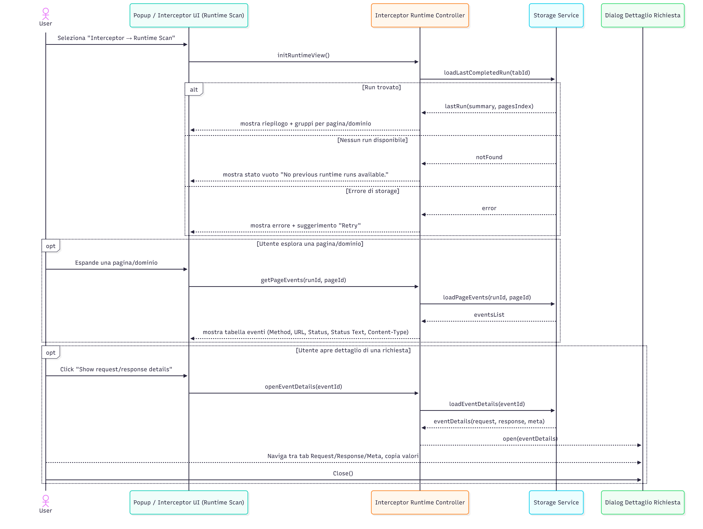
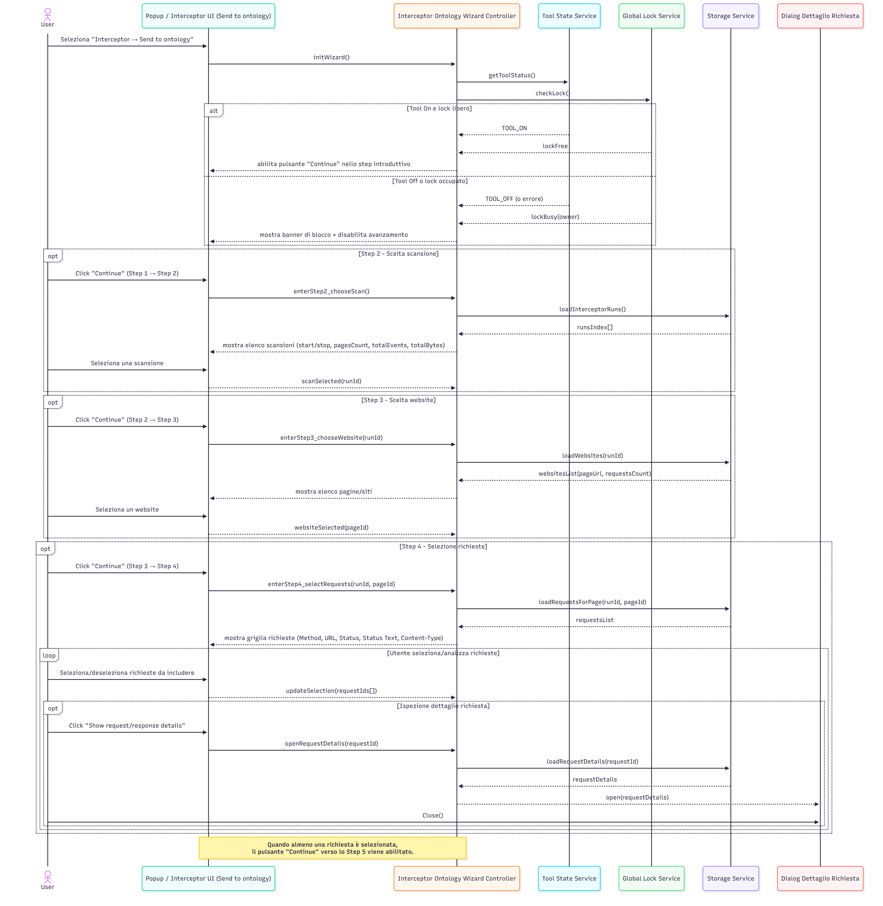

# Interceptor – Sequence Diagrams
---

**SD-EXT-INT-01 – Avvio, esecuzione e arresto di una sessione Runtime Interceptor (lock globale + pannello di stato)**

Descrizione (alto livello):  

Questo diagramma mostra il ciclo di vita di una sessione Runtime Interceptor:
- quando l’utente apre la vista **Runtime Scan**, la UI chiede al controller lo stato corrente (RUNNING/STOPPED) e i contatori;
- se la sessione è ferma e il lock globale è libero, il click su **Start interceptor** porta all’acquisizione del lock, all’avvio del motore di cattura sul tab corrente e all’inizializzazione del pannello di stato (RUNNING con contatori azzerati);
- durante l’esecuzione, ogni evento intercettato viene salvato a storage e i contatori (pagine, eventi, bytes) vengono aggiornati in tempo quasi reale;
- se il lock è già occupato, l’avvio viene rifiutato e la UI mostra un messaggio che spiega quale scansione è in corso;
- quando l’utente ferma la sessione con **Stop interceptor**, il motore di cattura viene arrestato, i dati finali vengono salvati, il lock rilasciato e il pannello passa a STOPPED mostrando il riepilogo del run.

---

**SD-EXT-INT-02 – Caricamento automatico e consultazione dell’ultima sessione Runtime Interceptor**

Descrizione (alto livello):  

Questo diagramma descrive cosa accade quando l’utente apre **Runtime Scan** senza una sessione live:
- la UI chiede al controller di inizializzare la vista;
- il controller tenta di caricare dallo storage l’ultima sessione runtime completata, prioritizzando il contesto della scheda corrente;
- se un run è disponibile, la UI mostra un riepilogo (start/stop, numero pagine, eventi, bytes) e l’indice pagine/domìni; se non c’è alcun run o si verifica un errore, viene mostrato rispettivamente uno stato “vuoto” o un messaggio di errore con possibilità di retry;
- espandendo una pagina/dominio, la UI chiede gli eventi associati e costruisce una tabella con le colonne principali (Method, URL, Status, Status Text, Content-Type);
- cliccando su una riga, si apre un dialog di dettaglio con i JSON completi di request/response/meta e informazioni sintetiche, che l’utente può ispezionare e copiare.

---

**SD-EXT-INT-03 – Gestione dell’archivio Runtime Interceptor (lista, refresh, caricamento run, delete singolo / massivo)**

Descrizione (alto livello):  

Questo diagramma copre le interazioni nella sottosezione **Archive** di Interceptor:
- al caricamento, la UI chiede al controller l’indice dell’archivio; il controller interroga lo storage e restituisce una lista di sessioni o un messaggio “vuoto”/errore;
- l’archivio può aggiornarsi automaticamente quando viene salvata una nuova sessione runtime, oppure manualmente tramite il pulsante **Refresh**;
- espandendo una sessione, la UI richiede i dati completi del run, che vengono caricati dallo storage e mostrati con la stessa struttura della vista Runtime (raggruppamento per pagina, tabella richieste, dialog di dettaglio);
- l’utente può cancellare una singola sessione o eseguire un **Delete All**, in entrambi i casi con aggiornamento dell’elenco e notifiche di conferma o errore.

---

**SD-EXT-INT-04 – Wizard “Send to ontology”: selezione scansione, website e richieste**

Descrizione (alto livello):  

Questo diagramma descrive il percorso guidato del wizard **Send to ontology** fino alla scelta delle richieste:
- all’ingresso, il controller verifica che il backend sia operativo e che il lock globale non sia occupato; in caso contrario, la UI mostra un blocco esplicito e impedisce di avanzare;
- nello **Step 2**, l’utente sceglie una scansione Interceptor salvata dall’archivio;
- nello **Step 3**, a partire dalla scansione scelta, viene proposto l’elenco delle pagine/siti intercettati e l’utente ne seleziona uno;
- nello **Step 4**, vengono caricate le richieste HTTP associate a quella pagina, mostrate in una griglia con le colonne principali; l’utente può selezionare più richieste e ispezionare i dettagli di ciascuna tramite un dialog dedicato;
- solo quando esiste almeno una richiesta selezionata, il wizard permette di procedere allo step successivo di conferma e invio.

---

**SD-EXT-INT-05 – Invio richieste a GraphDB / resolver e monitoraggio job (“Job Summaries”)**

Descrizione (alto livello):  

Questo diagramma copre la fase finale del wizard **Send to ontology**:
- nello **Step 5**, l’utente vede il riepilogo delle richieste selezionate, può attivare/disattivare l’opzione di resolver e avvia l’invio con **Send Requests**;
- prima di inviare, il controller verifica nuovamente che il backend sia **Tool On** e che non ci siano lock incompatibili; in caso di problemi, la UI mostra un messaggio e non invia nulla;
- se le precondizioni sono soddisfatte, le richieste vengono suddivise in batch; per ogni batch il backend può accettare la richiesta (creando uno o più job) oppure restituire un errore, che viene riportato nel riepilogo;
- dopo l’invio, si apre il dialog **Job Summaries** e un componente di monitoraggio interroga periodicamente il backend (e/o riceve eventi) aggiornando in tempo reale lo stato dei job (in corso/completed/failed);
- quando tutti i job hanno raggiunto uno stato finale, il polling si ferma; alla pressione di **OK**, il dialog viene chiuso, il monitor stoppato e il wizard riportato allo stato iniziale, pronto per un nuovo invio.

---
