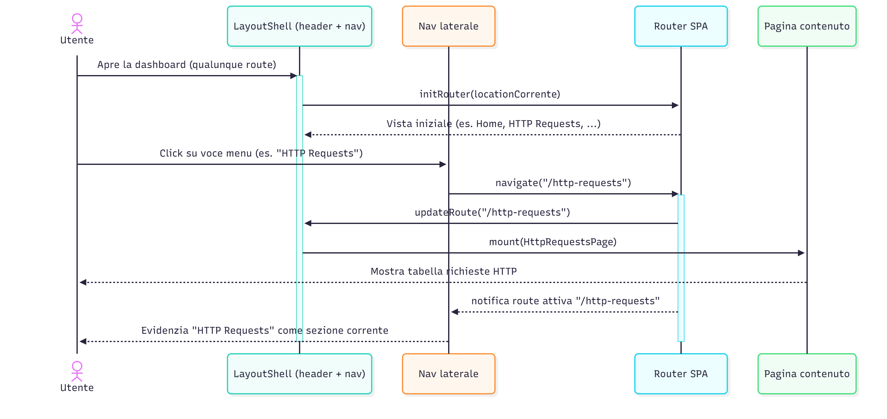
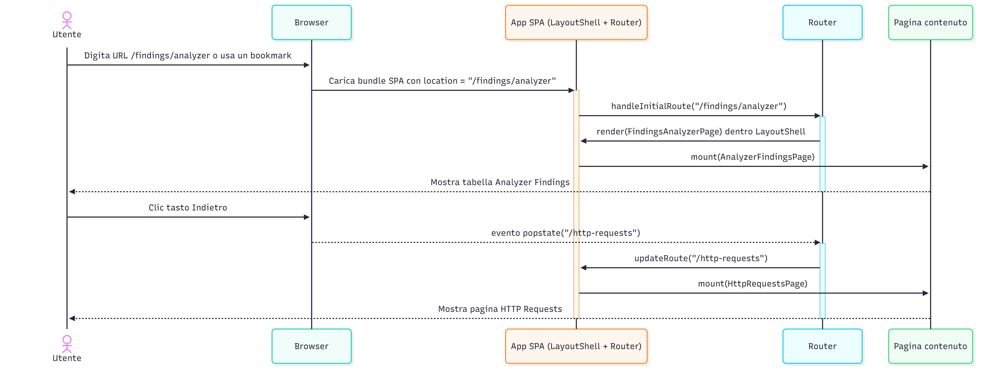
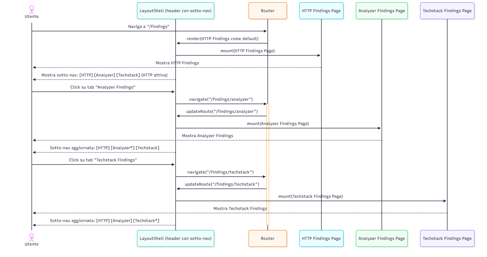
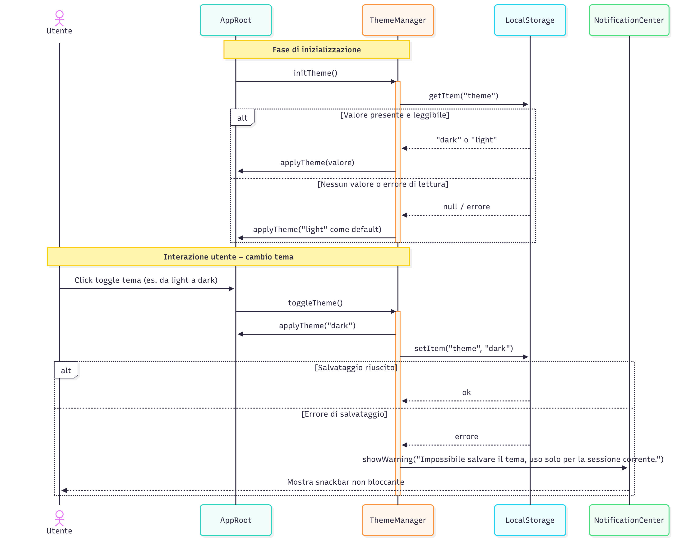
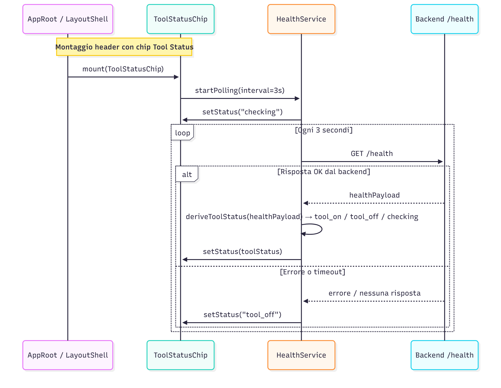
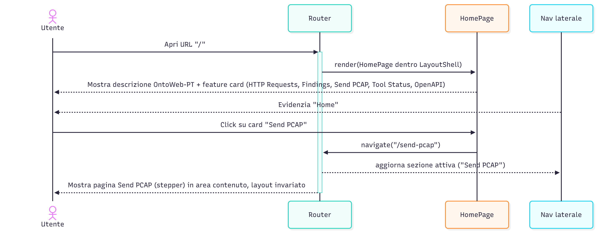

# Global – Sequence Diagrams
---

**SD-DASH-GLOB-01 – Navigazione tra sezioni principali dalla barra laterale**

Descrizione (alto livello):

Questo diagramma mostra la navigazione principale tra le sezioni della dashboard tramite la barra laterale sinistra. L’utente clicca su una voce (es. “HTTP Requests”), il router client-side aggiorna la route e il LayoutShell rimpiazza solo l’area di contenuto con la pagina corrispondente, lasciando invariati header e nav laterale. La voce scelta viene evidenziata come sezione attiva.

---

**SD-DASH-GLOB-02 – Navigazione tramite URL dirette e tasti Indietro/Avanti del browser**

Descrizione (alto livello):

Questo diagramma illustra il comportamento del routing client-side quando l’utente usa direttamente la barra degli indirizzi o i tasti Indietro/Avanti del browser. L’app SPA interpreta l’URL iniziale e rende la pagina corretta all’interno del LayoutShell; gli eventi di history (popstate) aggiornano solo l’area contenuti mantenendo coerenti header e nav laterale.

---

**SD-DASH-GLOB-03 – Sotto-navigazione contestuale per Findings (HTTP / Analyzer / Techstack)**

Descrizione (alto livello):

Questo diagramma descrive la sotto-navigazione interna alla sezione Findings. Quando l’utente si trova su una route che inizia con `/findings`, il LayoutShell mostra tre tab (HTTP, Analyzer, Techstack). I click sui tab invocano il router, che cambia solo il contenuto della pagina (lista di findings) e aggiorna lo stato della sotto-nav per evidenziare la sotto-sezione attiva.

---

**SD-DASH-GLOB-04 – Cambio tema chiaro/scuro e persistenza (con degrado controllato)**

Descrizione (alto livello):

Questo diagramma mostra come la dashboard gestisce il tema globale. All’avvio viene letta la preferenza da `localStorage` e applicato un default se la lettura fallisce. Quando l’utente cambia tema tramite il toggle nella barra superiore, il ThemeManager aggiorna immediatamente l’aspetto di tutta la UI e tenta di salvare la preferenza; eventuali errori di salvataggio producono solo un warning non bloccante, mantenendo la dashboard pienamente utilizzabile.

---

**SD-DASH-GLOB-05 – Polling dello stato del Tool (health backend) e aggiornamento chip globale**

Descrizione (alto livello):

Questo diagramma illustra il ciclo di polling dello stato del backend. Il chip globale “Tool Status” si registra presso un servizio di health che, a intervalli regolari, interroga l’endpoint `/health`, deriva uno stato sintetico (`tool_on`, `tool_off`, `checking`) e aggiorna il chip. In caso di errore o assenza di risposta, lo stato passa a “Tool Off” senza bloccare il resto della dashboard.

---

**SD-DASH-GLOB-06 – Home/Dashboard come pagina di onboarding e accesso rapido**

Descrizione (alto livello):

Questo diagramma descrive l’atterraggio sulla Home della dashboard e l’uso delle “feature card” come scorciatoie verso le altre sezioni. L’utente arriva su `/` o `/home`, vede la spiegazione dello strumento e le card cliccabili; selezionandone una, il router lo porta alla sezione corrispondente riutilizzando lo stesso layout globale (header + nav laterale).

---

**SD-DASH-GLOB-07 – Notifiche globali non bloccanti (scenario generico)**

Descrizione (alto livello):

Questo diagramma cattura il pattern comune di feedback nella dashboard. Qualunque pagina (HTTP Requests, Findings, Send PCAP, ecc.) dopo una chiamata al backend mostra una notifica sintetica tramite un NotificationCenter globale. Le snackbar confermano successi o segnalano errori, ma non bloccano l’interazione: l’utente può continuare a usare la UI mentre il messaggio è visibile.

---

**SD-DASH-GLOB-08 – Degrado controllato per problemi di storage locale o health backend**

Descrizione (alto livello):

Questo diagramma mostra come la dashboard continua a funzionare anche se si verificano problemi con lo storage locale o con il servizio di health. All’avvio, l’app tenta in parallelo di leggere il tema e di recuperare lo stato del tool; in caso di errore, ripiega su un tema di default e imposta lo stato globale su “Tool Off”, ma il LayoutShell viene comunque renderizzato e l’utente può navigare tra le pagine e usare le funzionalità core senza blocchi.

---