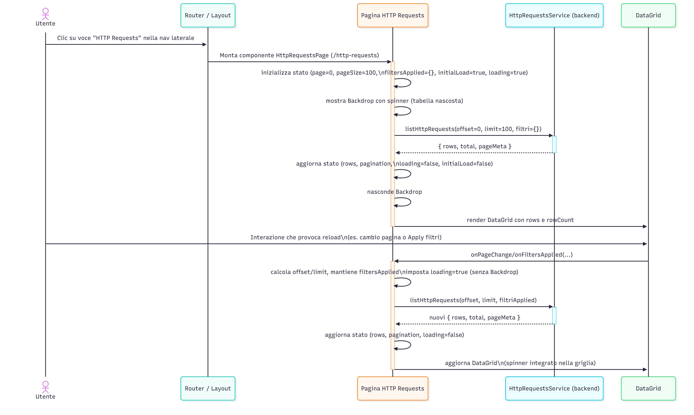
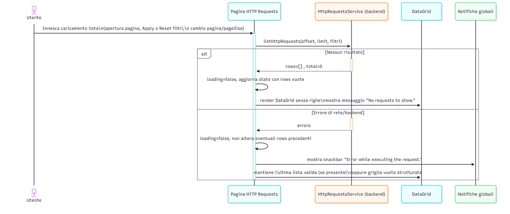

# Http Requests – Sequence Diagrams
---

**SD-DASH-HTTP-01 – Caricamento iniziale della pagina “HTTP Requests” (prima pagina con Backdrop)**

Descrizione (alto livello):

Questo diagramma mostra il comportamento della pagina “HTTP Requests” al primo accesso e nei reload successivi. Al primo caricamento, la pagina:
- viene montata dal router e inizializza stato, paginazione e filtri;
- mostra un Backdrop bloccante con spinner finché non arriva la prima pagina di risultati;
- alla risposta del backend, nasconde il Backdrop e popola la DataGrid.

Nei caricamenti successivi (paginazione, filtri, ecc.) viene usato solo lo spinner interno alla griglia, senza bloccare l’intera pagina.

---

**SD-DASH-HTTP-02 – Paginazione server-side e cambio page size mantenendo i filtri**

Descrizione (alto livello):

Questo diagramma illustra come funziona la paginazione server-side nella vista “HTTP Requests”:

- Quando l’utente cambia pagina, la DataGrid notifica il componente padre, che calcola `offset` e `limit` mantenendo i filtri correnti e aggiorna la lista tramite il backend.
- Quando l’utente cambia il page size (es. 100 → 50), la pagina viene resettata alla prima pagina (`offset=0`) ma i filtri rimangono invariati.
- In caso di errore durante il cambio pagina/page size, viene mostrata una snackbar di errore, mentre l’ultima lista valida rimane visibile.

---

**SD-DASH-HTTP-03 – Applicazione dei filtri con “Apply” e Reset alla lista non filtrata**

Descrizione (alto livello):

Il diagramma descrive il flusso di gestione dei filtri:
- La toolbar mantiene i valori correnti dei campi e notifica il componente padre ad ogni modifica.
- Il pulsante **Apply** si abilita solo quando i valori correnti differiscono dai filtri “applicati”.
- Cliccando **Apply**, la pagina invia una nuova richiesta al backend a partire dalla prima pagina, con solo i filtri non vuoti, e mostra una snackbar di conferma.
- Cliccando **Reset**, tutti i filtri vengono azzerati, la paginazione riparte da `offset=0` e viene ricaricata la lista “grezza” senza filtri.

---

**SD-DASH-HTTP-04 – Gestione errore di listing e stato “nessun risultato”**

Descrizione (alto livello):

Questo diagramma copre due casi particolari del caricamento lista:

- Quando il backend risponde con zero risultati, la DataGrid non mostra alcuna riga e, al posto dei dati, compare un messaggio esplicito “No requests to show.”; l’utente può quindi rilassare i filtri o cambiare pagina.
- Quando il backend restituisce un errore, viene mostrata una snackbar non bloccante e la pagina riporta `loading=false` lasciando visibile l’ultimo set di dati valido (se esiste), senza andare in errore fatale.

---

**SD-DASH-HTTP-05 – Apertura e consultazione del dettaglio di una richiesta HTTP nel drawer**

Descrizione (alto livello):

Questo diagramma descrive il flusso di apertura del dettaglio di una singola richiesta HTTP:
- L’utente clicca sull’icona “View details” nella riga di interesse; la pagina apre un drawer laterale e invia una richiesta `getHttpRequestById`.
- Finché i dati non arrivano, il drawer mostra uno spinner; una volta ricevuti, vengono renderizzate le sezioni di riepilogo (metodo, status colorato, URL, metadati) e i dettagli di Request/Response (URI, headers, body con possibilità di copia).
- In caso di errore nel recupero, il drawer viene chiuso automaticamente e viene mostrata una snackbar di errore, senza lasciare il dettaglio in uno stato inconsistente.

---