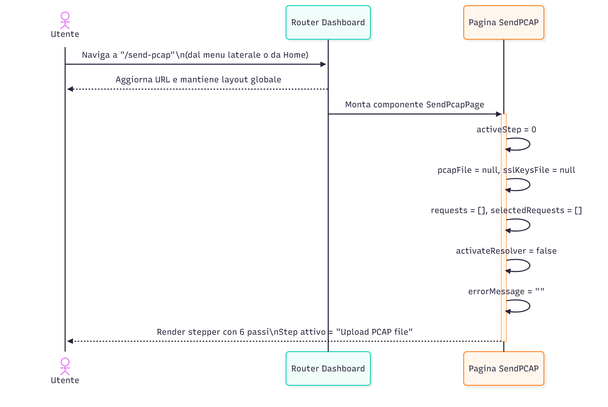
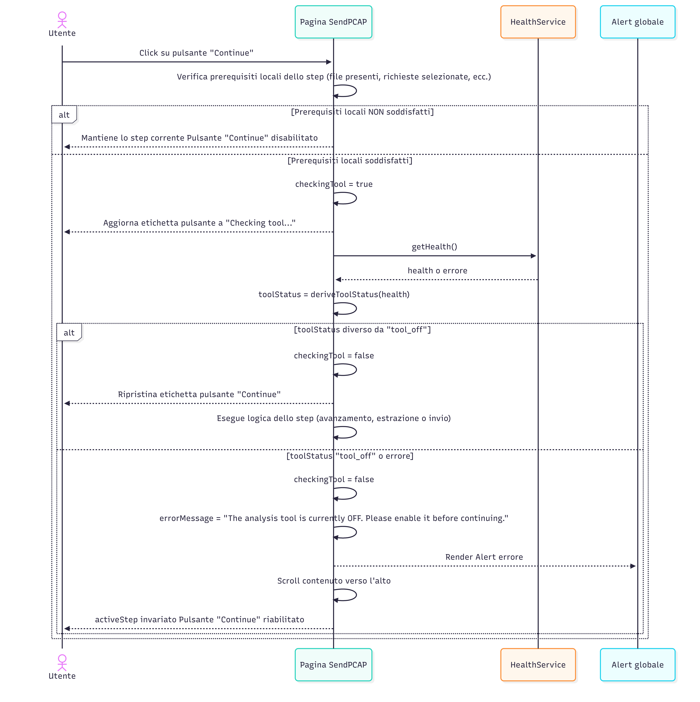
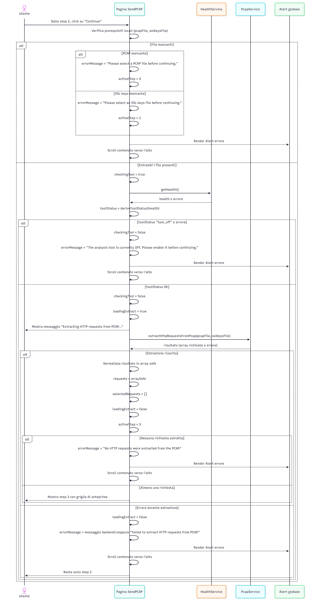
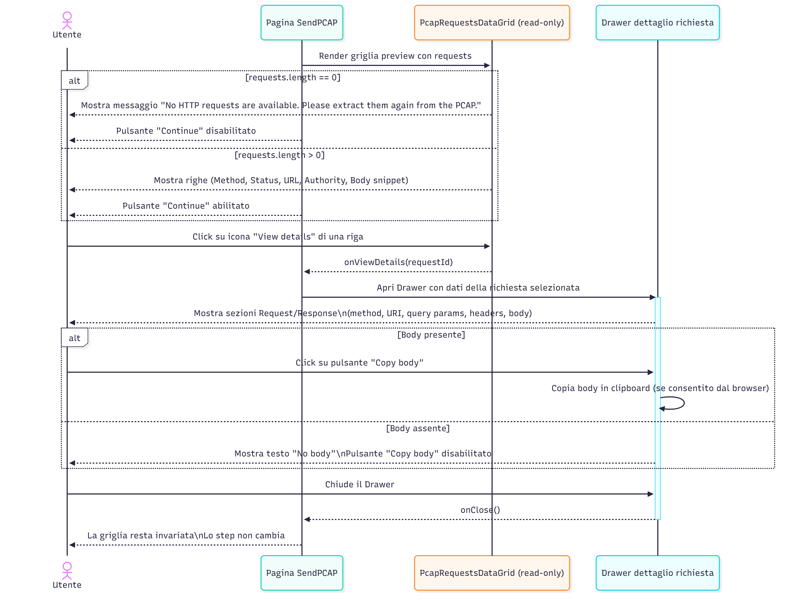
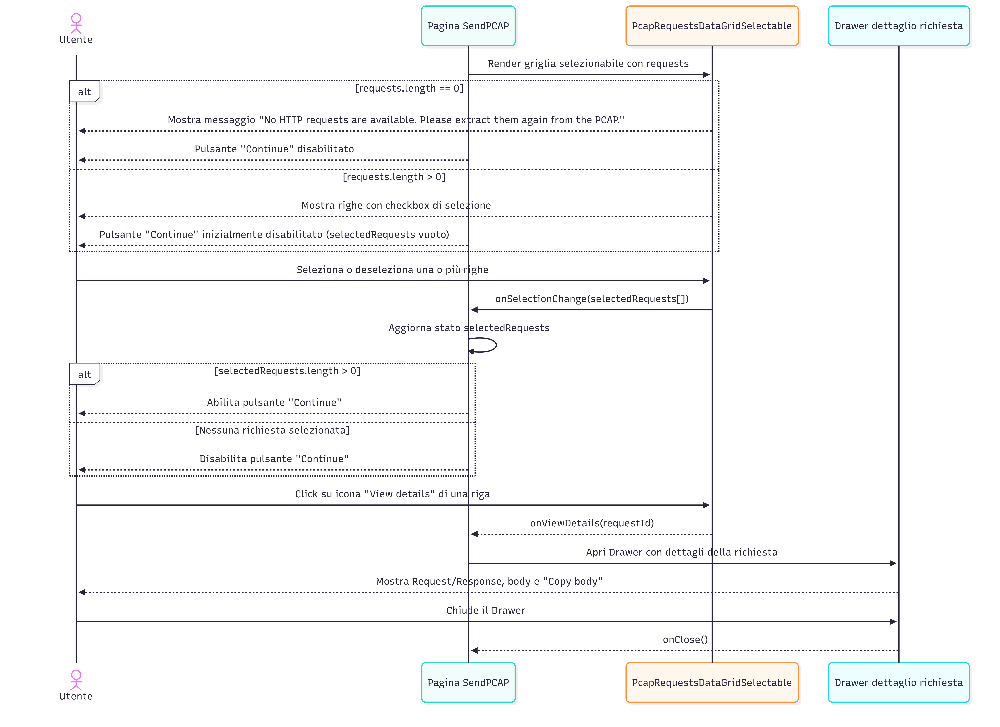
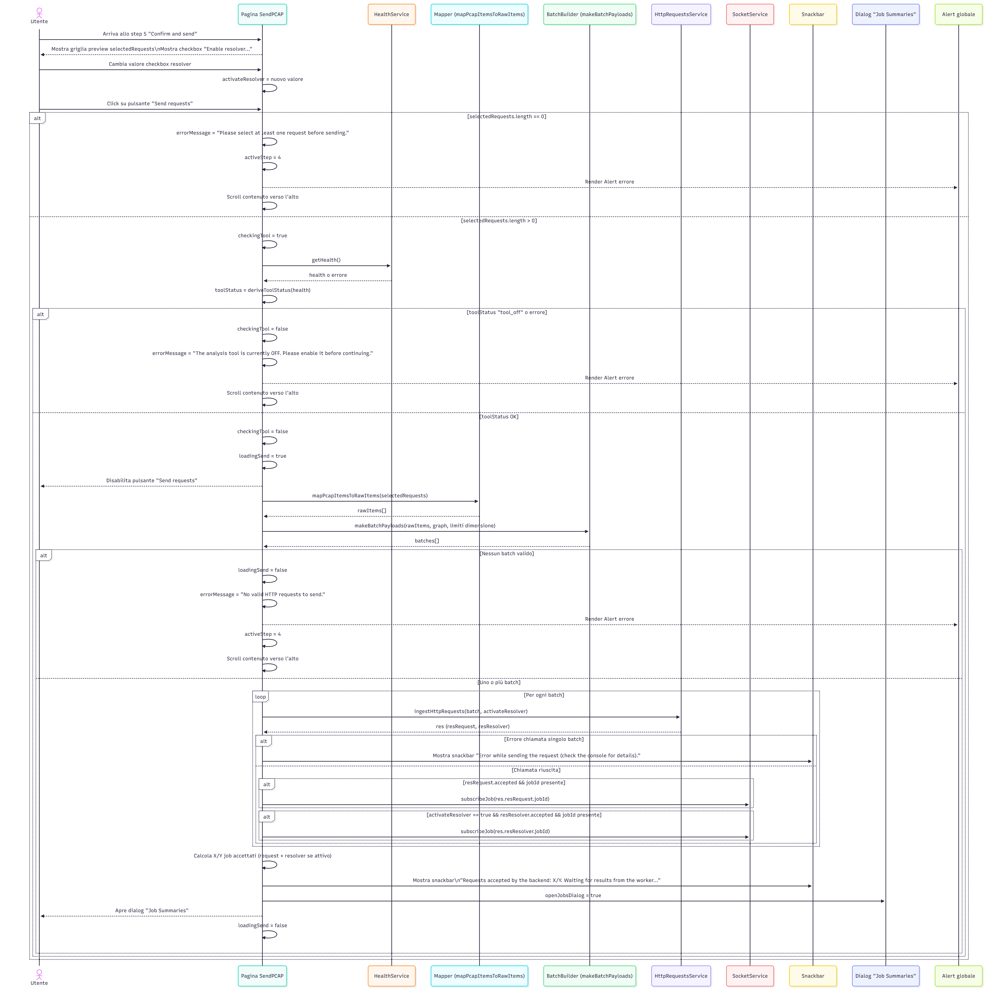
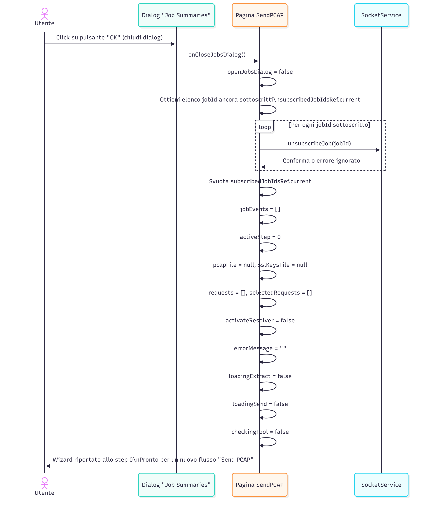
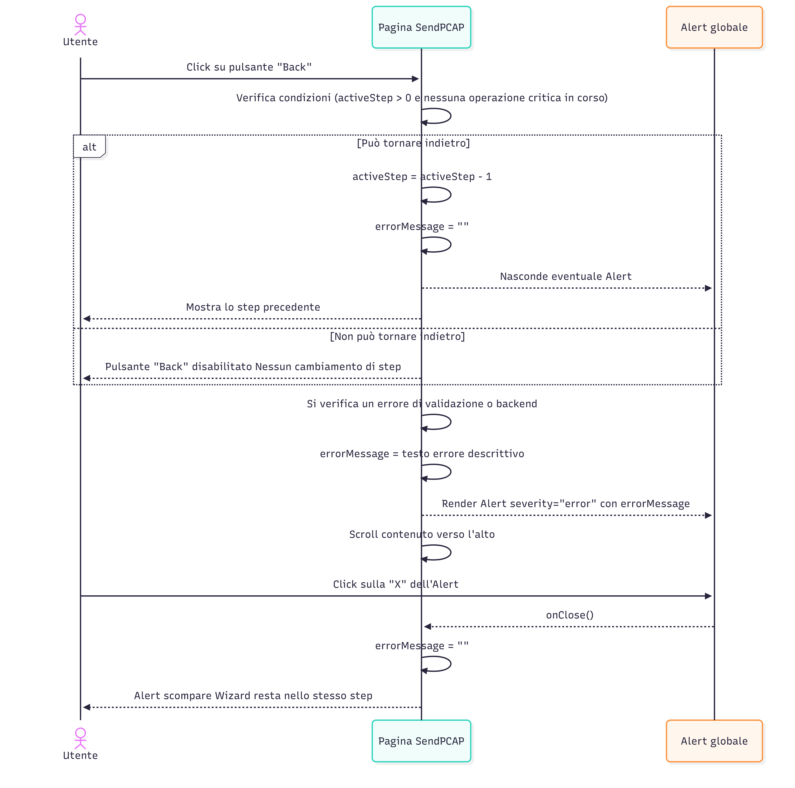

# Send PCAP – Sequence Diagrams
---

**SD-DASH-PCAP-01 – Apertura pagina “Send PCAP” e inizializzazione del wizard**

Descrizione (alto livello):

Questo diagramma mostra cosa accade quando l’utente apre la pagina “Send PCAP”: il router carica la pagina all’interno del layout comune, il componente inizializza tutto lo stato interno del wizard (step attivo, file, liste, flag) e visualizza lo stepper verticale con il primo passo selezionato.

---

**SD-DASH-PCAP-02 – Caricamento e validazione dei file PCAP e SSL keys**

Descrizione (alto livello):

Questo diagramma illustra il caricamento dei file PCAP e SSL keys: la pagina apre il file chooser, verifica le estensioni consentite, aggiorna lo stato interno e, in caso di file non valido, scarta il file, imposta un messaggio di errore globale e fa scroll verso l’alto per rendere visibile l’alert.

---

**SD-DASH-PCAP-03 – Controllo dello stato del tool prima del pulsante “Continue”**

Descrizione (alto livello):

Questo diagramma descrive il controllo globale dello stato del tool che avviene prima di ogni “Continue”: se i prerequisiti locali dello step sono ok, la pagina effettua un health-check, mostra “Checking tool...”, e solo se il tool non è OFF permette di proseguire; in caso contrario mostra un alert di errore e blocca l’avanzamento.

---

**SD-DASH-PCAP-04 – Estrazione delle richieste HTTP dal PCAP**

Descrizione (alto livello):

Questo diagramma copre lo step di estrazione: verifica la presenza dei file, esegue il controllo tool, chiama il servizio di estrazione, aggiorna lo stato con le richieste ottenute e passa direttamente allo step “Preview extracted requests”, gestendo esplicitamente i casi di file mancanti, nessuna richiesta estratta o errore di backend.

---

**SD-DASH-PCAP-05 – Anteprima in sola lettura e dettaglio di una richiesta estratta**

Descrizione (alto livello):

Questo diagramma mostra lo step di anteprima: la griglia in sola lettura visualizza le richieste estratte, consente l’apertura di un drawer di dettaglio con URI, headers e body, e permette la copia del body quando presente, senza modificare lo stato del wizard.

---

**SD-DASH-PCAP-06 – Selezione delle richieste da inviare all’ontologia**

Descrizione (alto livello):

Questo diagramma descrive lo step di selezione: la griglia consente la selezione multipla delle richieste, comunica al componente padre la lista aggiornata, abilita o disabilita il pulsante “Continue” in base al numero di richieste selezionate e mantiene la possibilità di aprire il dettaglio di ciascuna richiesta.

---

**SD-DASH-PCAP-07 – Conferma, normalizzazione, batching e invio delle richieste**

Descrizione (alto livello):

Questo diagramma copre lo step finale di conferma e invio: la pagina controlla che ci siano richieste selezionate, riesegue il controllo tool, mappa le richieste in formato raw, le suddivide in batch, invia ogni batch al backend, sottoscrive i job via WebSocket, mostra una snackbar di riepilogo e apre il dialog “Job Summaries”; gestisce anche i casi di nessun batch valido o errori sui singoli batch.

---

**SD-DASH-PCAP-08 – Monitoraggio dei job tramite WebSocket e polling nel dialog “Job Summaries”**

Descrizione (alto livello):

Questo diagramma descrive come il dialog “Job Summaries” aggrega lo stato dei job: riceve eventi via WebSocket, li salva in un buffer, costruisce riepiloghi sintetici per ogni jobId e, mentre il dialog è aperto, usa un polling di fallback per aggiornare lo stato dei job che non generano eventi, fermando automaticamente il polling quando non restano job da monitorare.

---

**SD-DASH-PCAP-09 – Chiusura del dialog “Job Summaries” e reset completo del wizard**

Descrizione (alto livello):

Questo diagramma mostra cosa succede quando l’utente chiude il dialog di monitoraggio: la pagina chiude il dialog, annulla le sottoscrizioni ai job residui, azzera lo storico degli eventi e reimposta l’intero stato del wizard allo step iniziale, permettendo un nuovo flusso di invio PCAP.

---

**SD-DASH-PCAP-10 – Navigazione con pulsante “Back” e gestione dell’alert globale di errore**

Descrizione (alto livello):

Questo diagramma riassume il comportamento del pulsante “Back” e dell’alert globale: “Back” permette di tornare allo step precedente solo se non ci sono operazioni critiche in corso, azzerando eventuali errori; ogni volta che si verifica un errore bloccante, la pagina imposta `errorMessage`, mostra un Alert in alto con scroll automatico e consente all’utente di chiuderlo senza interrompere il flusso del wizard.

---