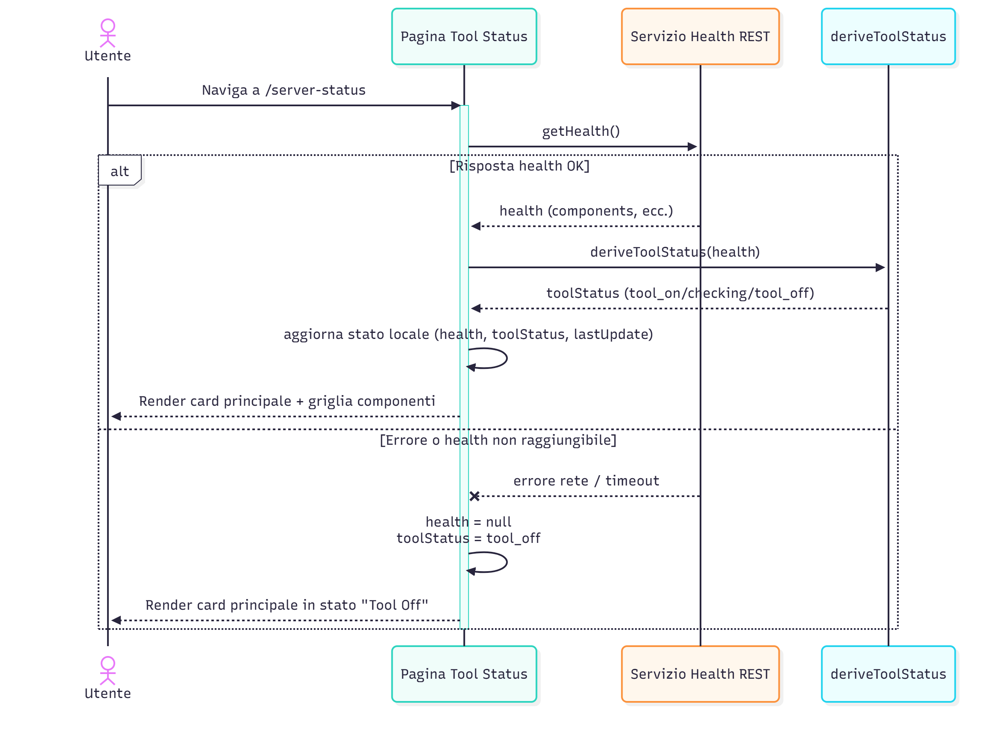
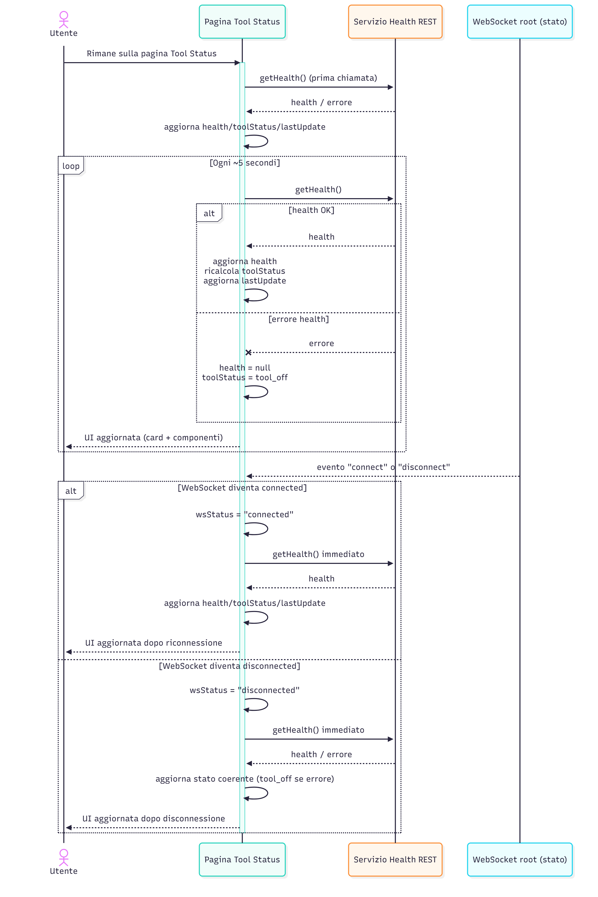
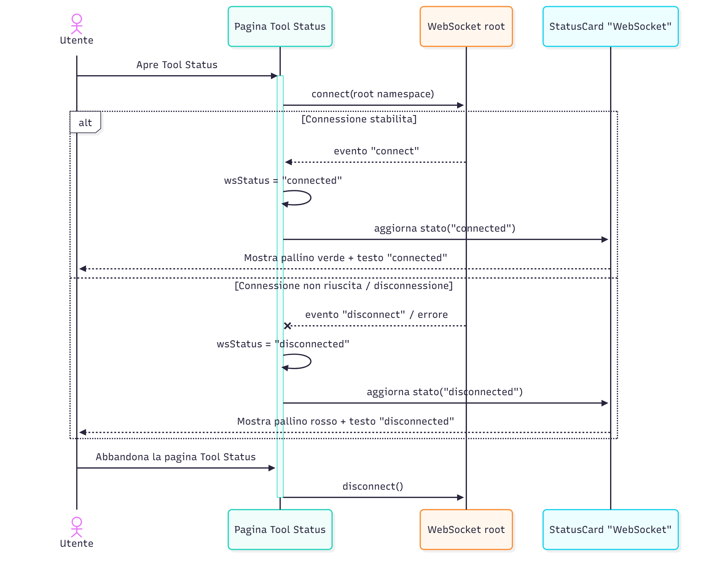
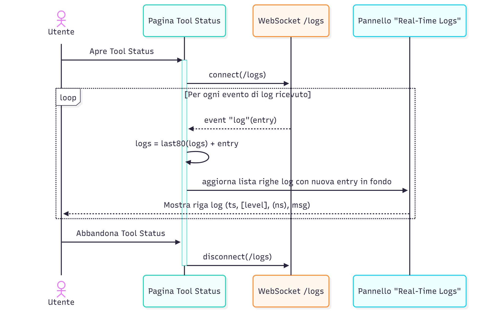
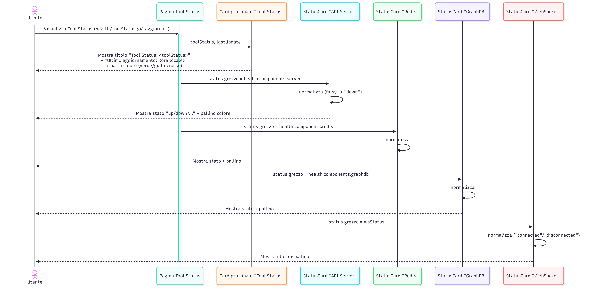
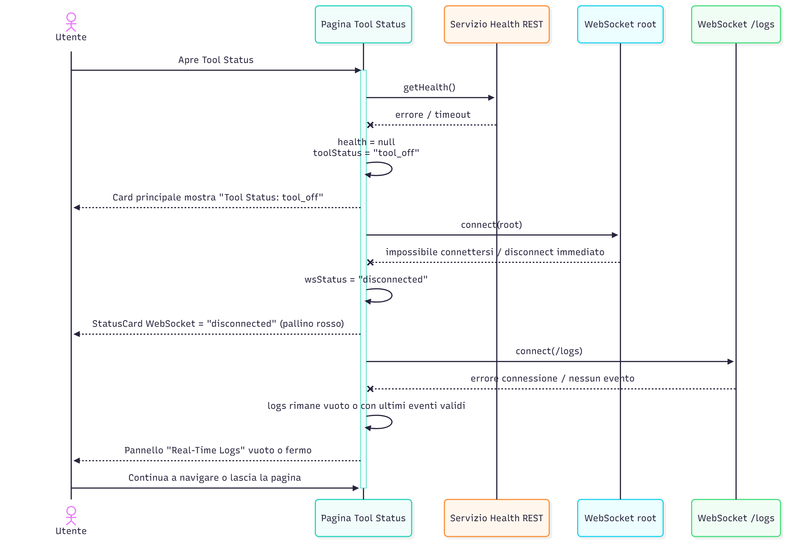

# Tool Status – Sequence Diagrams
---

**SD-DASH-STAT-01 – Apertura pagina Tool Status e primo recupero dello stato health**

Descrizione (alto livello):

Questo diagramma mostra cosa accade quando l’utente apre per la prima volta la pagina Tool Status:
- la pagina effettua subito una chiamata `getHealth()` al backend;
- se la chiamata va a buon fine, il risultato viene passato a `deriveToolStatus` per ottenere lo stato consolidato (`tool_on`, `checking`, `tool_off`) e aggiornare la card principale e la griglia componenti;
- se la chiamata fallisce, la pagina imposta `health = null`, `toolStatus = tool_off` e mostra comunque la card principale in stato “Tool Off”, senza errori bloccanti.

---

**SD-DASH-STAT-02 – Polling periodico dell’endpoint di health e reazione ai cambiamenti WebSocket**

Descrizione (alto livello):

Questo diagramma mostra il ciclo di polling e la sua sincronizzazione con lo stato del WebSocket:
- la pagina, dopo il primo `getHealth()`, crea un intervallo che richiama periodicamente l’endpoint di health (circa ogni 5 secondi);
- ad ogni risposta aggiorna `health`, `toolStatus` e l’orario di “Ultimo aggiornamento”, degradando a `tool_off` in caso di errore;
- quando lo stato del WebSocket root cambia (`connected`/`disconnected`), il polling viene “resettato” e viene effettuato subito un nuovo `getHealth()` per allineare la visione della pagina allo stato reale del backend.

---

**SD-DASH-STAT-03 – Gestione connessione WebSocket principale e StatusCard WebSocket**

Descrizione (alto livello):

Questo diagramma illustra come la pagina gestisce lo stato del WebSocket principale:
- all’apertura di Tool Status viene aperta una connessione WebSocket sul namespace root;
- all’evento `connect`, `wsStatus` viene impostato a `connected` e la StatusCard “WebSocket” mostra un indicatore verde con testo “connected”;
- all’evento `disconnect` o in caso di errore, `wsStatus` diventa `disconnected` e la card mostra un pallino rosso “disconnected”;
- quando l’utente lascia la pagina, la connessione WebSocket viene chiusa correttamente.

---

**SD-DASH-STAT-04 – Sottoscrizione al namespace /logs e aggiornamento del buffer circolare dei log**

Descrizione (alto livello):

Questo diagramma descrive il canale dedicato ai log in tempo reale:
- la pagina apre una seconda connessione WebSocket verso il namespace `/logs`;
- ad ogni evento `log` ricevuto, la entry viene aggiunta alla coda dei log mantenendo solo gli ultimi ~80 elementi;
- il pannello “Real-Time Logs” viene aggiornato mostrando le righe in ordine di arrivo (le più recenti in fondo);
- la connessione `/logs` viene chiusa correttamente quando l’utente lascia la pagina.

---

**SD-DASH-STAT-05 – Rendering della card principale e delle StatusCard dei componenti**

Descrizione (alto livello):

Questo diagramma mostra come lo stato applicativo viene tradotto in elementi visivi:
- la card principale riceve `toolStatus` e l’ultimo orario di aggiornamento, e li visualizza con una barra colorata;
- ogni StatusCard (API, Redis, GraphDB, WebSocket) riceve uno `status` grezzo, lo normalizza (es. `undefined` → `down`) e mostra testo e indicatore colorato (verde/giallo/rosso);
- l’utente vede così una panoramica sintetica ma completa del backend.

---

**SD-DASH-STAT-06 – Degrado controllato in caso di errori su health, WebSocket o log**

Descrizione (alto livello):

Questo diagramma illustra il comportamento di degrado controllato:
- se `getHealth()` fallisce, la pagina non va in errore ma assume `tool_off` e mostra tutte le StatusCard dei componenti come `down`;
- se il WebSocket root non si connette o cade, lo stato viene reso con `wsStatus = disconnected` e la relativa card mostra un pallino rosso;
- se il canale `/logs` non funziona, il pannello log resta semplicemente vuoto (o fermo all’ultimo stato valido), senza impattare il resto della pagina;
- in ogni caso la struttura di Tool Status rimane renderizzabile e l’utente può continuare a usare la dashboard o tornare alle altre sezioni.

---